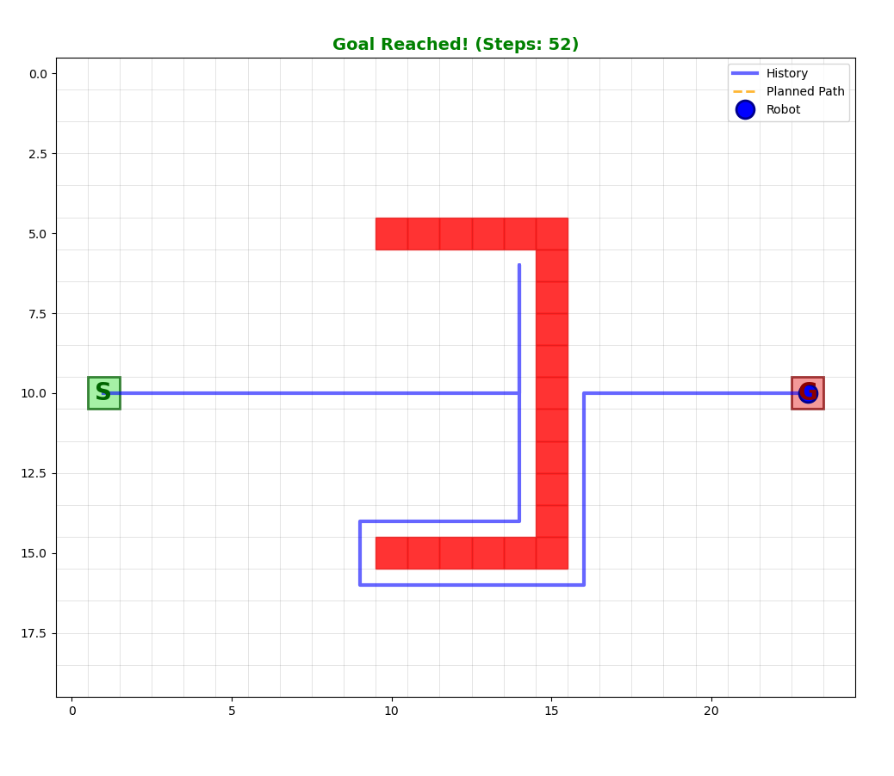
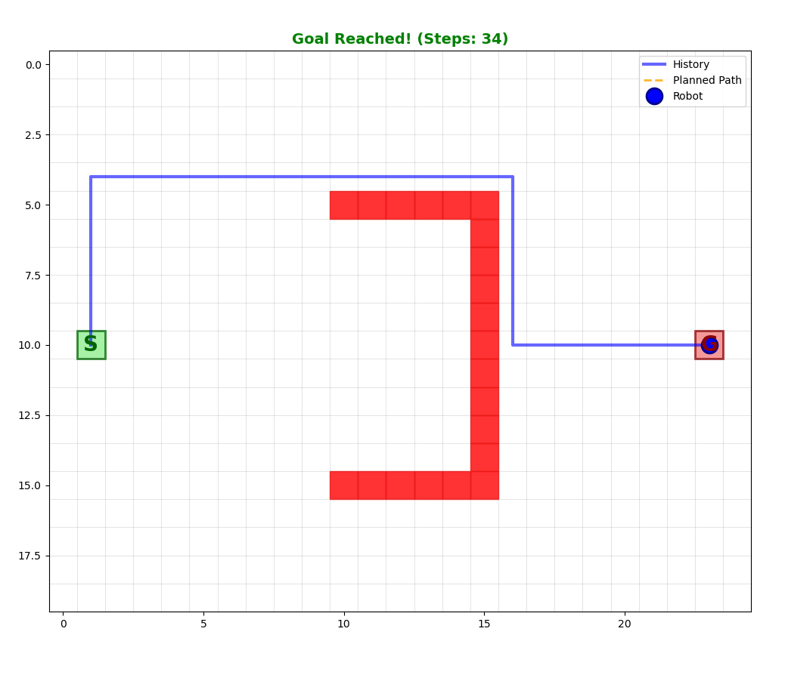
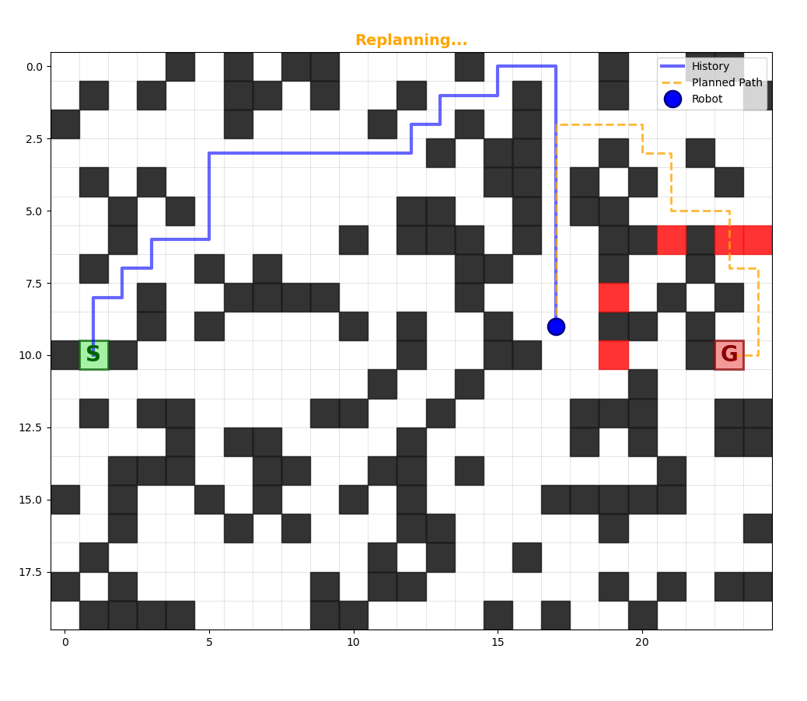
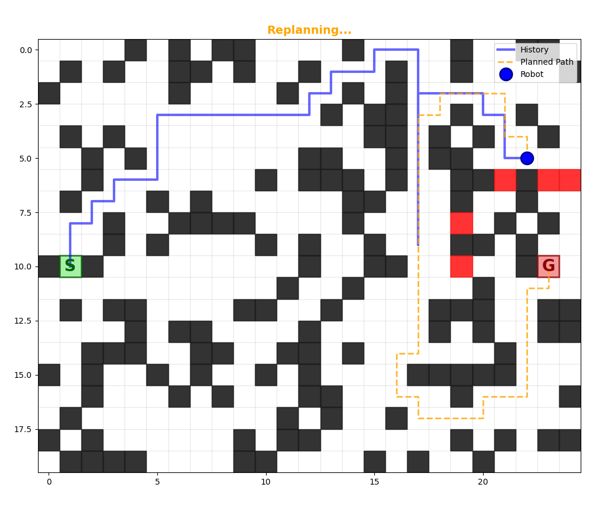
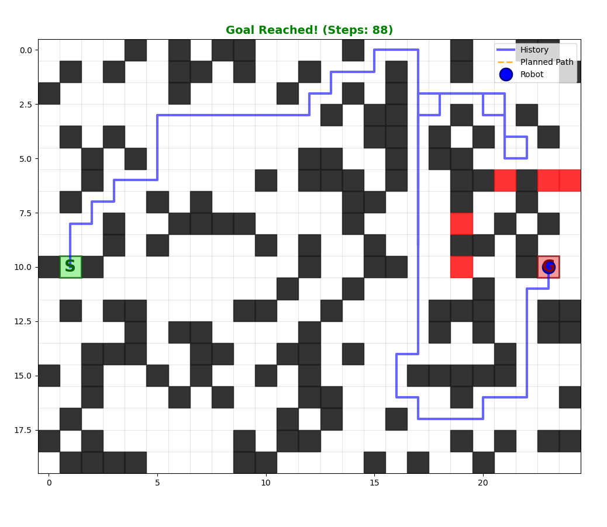
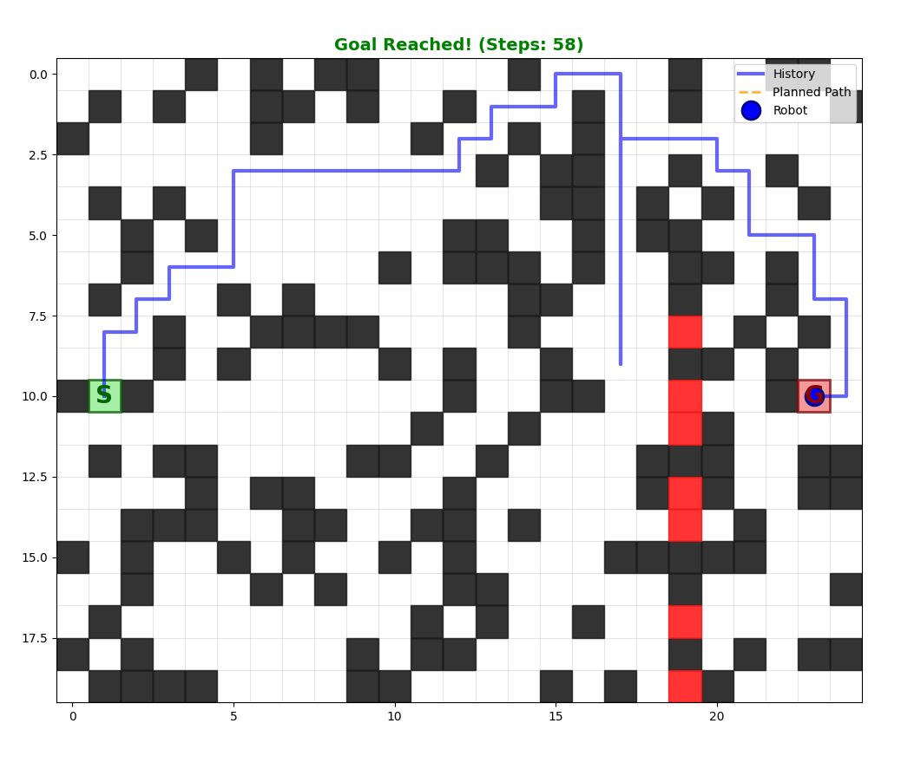
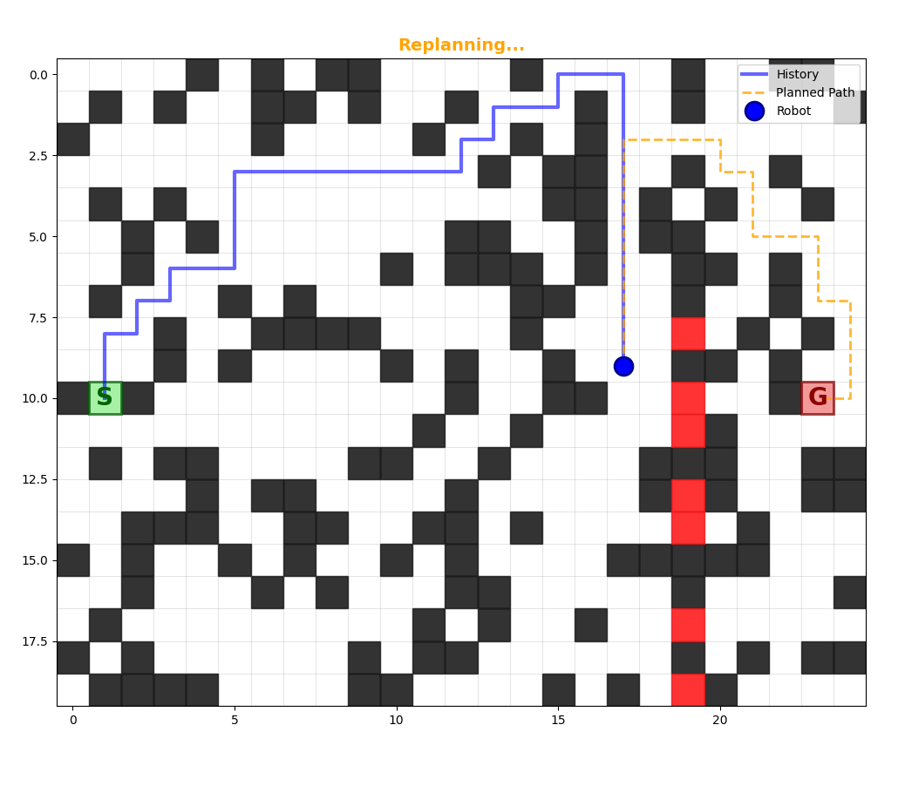
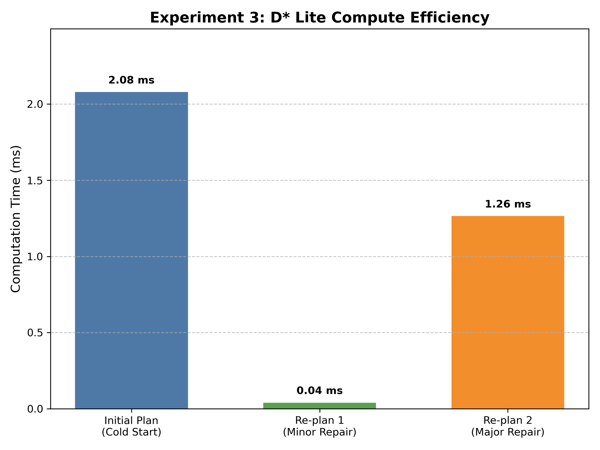

# D* Lite Path Planning Simulation

## 1. Topic Description

This repository contains a Python implementation of the **D* Lite** algorithm (Koenig & Likhachev, 2002). D* Lite is an incremental heuristic search algorithm that acts as a more efficient alternative to D* for dynamic pathfinding. It is widely used in autonomous mobile robotics for navigation in unknown or changing environments.

Unlike A*, which must replan from scratch when the map changes, D* Lite reuses information from previous searches to correct the path locally, making it computationally efficient for real-time applications.

## 2. Purpose of the Code Example

The purpose of this simulation is to demonstrate the **dynamic replanning capabilities** of D* Lite compared to static planning. The simulation provides an interactive grid environment where:

1. A robot attempts to navigate from a Start (S) to a Goal (G).
2. The user can introduce new obstacles in real-time while the robot is moving.
3. The algorithm detects the change, updates inconsistent cost nodes, and generates a new optimal path without recalculating the entire map.

## 3. Implementation Details

Following are the implementation details:

* **Configuration Space:** A 2D discrete grid where each cell represents a distinct robot configuration $(x, y)$.
* **Kinematic Configuration:** The robot is modeled as a holonomic agent with **Manhattan Motion constraints** (4-connected graph).

  * **Motion Primitive:** The robot can move instantaneously North, South, East, or West.
  * **Constraint:** Diagonal movement is disabled to strictly prevent *corner cutting* (moving diagonally through a gap between two diagonal obstacles), ensuring collision-free trajectories in narrow corridors.
* **Graph Construction:**

  * **Vertices (V):** Every cell in the grid.
  * **Edges (E):** Connections exist between adjacent neighbors.
  * **Edge Weights:** Cost = 1 for free space, Cost = ∞ for obstacles.

## 4. Setup Instructions

### Prerequisites

* Python 3.8 or higher
* `pip` (Python package manager)

### Dependencies

Install the required libraries using the provided requirements file:

```bash
pip install -r requirements.txt
```

* `numpy`: For grid management and random seed generation.
* `matplotlib`: For real-time visualization and animation.

## 5. Running Instructions

To execute the main simulation script:

```bash
python src/maze_simulator.py
```

### Expected Behavior

1. **Visualization:** A Matplotlib window will open showing a grid.

   * **Green S**: Start position.
   * **Red G**: Goal position.
   * **Black Squares**: Initial static obstacles.
2. **Interaction:** Click anywhere on the grid to add new obstacles (Red Squares) *before* or *during* the robot's movement.
3. **Start:** Press the **SPACEBAR** to begin the simulation.
4. **Feedback:**

   * **Blue Line**: The path the robot has traversed (history).
   * **Orange Dashed Line**: The current computed optimal path to the goal.
   * **Console Output**: Displays step counts and "Replanning..." performance metrics.


## 6. Experimental Results

We conducted three experiments to validate the algorithm's performance with respect to environmental variations and computational efficiency.

### Experiment 1: Sensor Range & Path Optimality

* **Objective:** To investigate how the robot's sensor range affects the optimality of the chosen path.
* **Procedure:** A U-shaped trap (local minimum) was placed in the environment. We compared a *blind* robot ($r = 1$) against a *far-sighted* robot ($r = 20$).
* **Results:**

  * **Short Range ($r = 2$):** The robot entered the trap, reached the dead end, and was forced to backtrack.
  * **Long Range ($r = 15$):** The robot detected the concavity from the start node and planned an optimal path around it.
* **Conclusion:** D* Lite guarantees optimality *given the current information*, but limited sensor data inevitably leads to longer total trajectories in complex environments.

|                   Short Range (r = 2)                  |                  Long Range (r = 15)                 |
| :----------------------------------------------------: | :--------------------------------------------------: |
|  |  |

### Experiment 2: Dynamic Replanning Visualization

* **Objective:** To demonstrate the algorithm's ability to repair paths in real time when new obstacles appear.
* **Procedure:** The robot began moving on an optimal path. A user manually inserted an obstacle blocking the path.
* **Observation:** The algorithm detected the collision, updated the edge costs, and the **orange dashed line** (planned path) instantaneously snapped to a new valid route.

**Replanning Sequence:**





### Experiment 3: Computational Efficiency Analysis

* **Objective:** To quantify the speed advantage of D* Lite's incremental updates versus a full re-calculation.
* **Procedure:** We timed the *initial plan* (cold start) and two subsequent *re-planning* events.  
* **Results:**

| Event            | Time (ms)   | Speedup vs Initial | Interpretation                                                                 |
| :--------------- | :---------- | :----------------- | :----------------------------------------------------------------------------- |
| **Initial Plan** | 2.08 ms     | 1× (Baseline)      | Full calculation of grid state.                                                |
| **Re-plan 1**    | **0.04 ms** | **~52× Faster**    | **Minor repair:** Local update affecting few nodes.                            |
| **Re-plan 2**    | **1.26 ms** | **~1.6× Faster**   | **Major repair:** Obstacle blocked critical path; larger propagation required. |

### Experiment 3: Visual Results

**Environment Map**



**Minor Replanning**


**Major Replanning**



**Computation Time Comparison**




## References

1. S. Koenig and M. Likhachev. *D* Lite.* AAAI/IAAI, 2002.
2. H. Choset, K. M. Lynch, S. Hutchinson, G. A. Kantor, W. Burgard, L. E. Kavraki, and S. Thrun. Principles of Robot Motion: Theory, Algorithms, and Implementation. MIT Press, 2005.
3. Atsushi Sakai et al. **PythonRobotics**: A Python code collection of robotics algorithms, including D* Lite path planning.  
   GitHub repository: https://github.com/AtsushiSakai/PythonRobotics  
   Used as an initial conceptual reference; final implementation is independently written.

